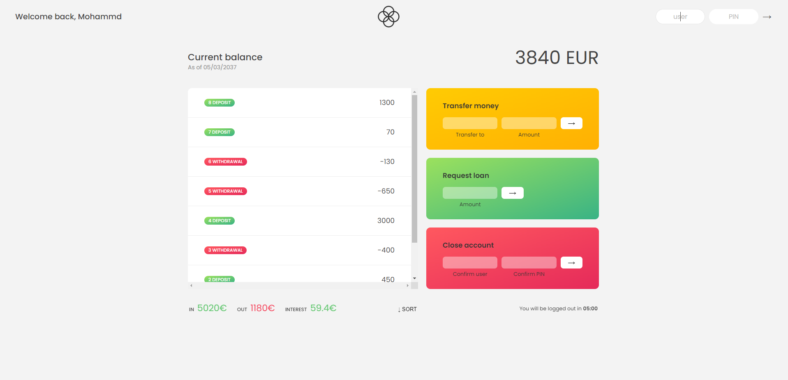

## Project Description

#### Goals:

The main goal of this project is to create a web application that simulates a simple banking system where users can manage their bank accounts. Users can view their deposits and withdrawals, request loans, transfer money to other accounts, and delete their accounts.

##### Features:

1. Account Management:

- Users can log in to their accounts using a username and PIN.
- Each account displays the owner's name, account movements (deposits and withdrawals), balance, and a summary of income, expenses, and interest earned.

2. Deposits and Withdrawals:

- Users can view a list of all their deposits and withdrawals.
- The transactions are displayed in a clear, itemized format, showing the type (deposit or withdrawal) and amount.

3. Loan Requests:

- Users can request a loan if they meet certain conditions (e.g., the loan amount requested must be less than or equal to 10% of the user's total deposits).
- The loan amount is added to the user's account movements and updates their balance.

4. Money Transfers:

- Users can transfer money to other users' accounts.
- Transfers are only allowed if the user has sufficient balance and the recipient account exists.

5. Account Deletion:

- Users can close their accounts by providing their username and PIN.
- Once confirmed, the account is removed from the system.

6. Sorting Transactions:

- Users can sort their transactions in ascending or descending order.
- Technologies Used:

7. HTML:

- Structured the web application layout, including the login form, account overview, transaction list, and control buttons.

8. CSS:

- Styled the web application to create a user-friendly and visually appealing interface.
- Applied responsive design techniques to ensure the application works well on various devices.

9. JavaScript (ES6):

- Implemented the core functionality of the banking system, including user authentication, transaction management, balance calculation, and account operations.
- Used modern JavaScript features (e.g., arrow functions, template literals, destructuring) for clean and efficient code.

10. DOM Manipulation:

- Dynamically updated the HTML elements based on user interactions and application state changes.
- Managed classes on HTML elements to reflect the current state (e.g., active user, transaction type).

11. Event Listeners:

- Utilized addEventListener to handle user actions, such as logging in, transferring money, requesting loans, deleting accounts, and sorting transactions.

